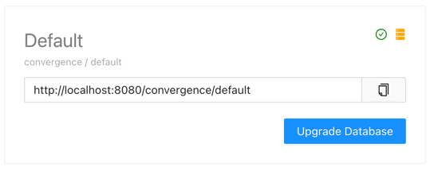
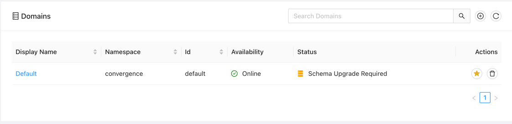
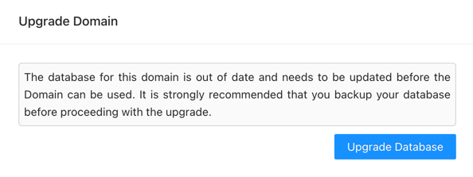
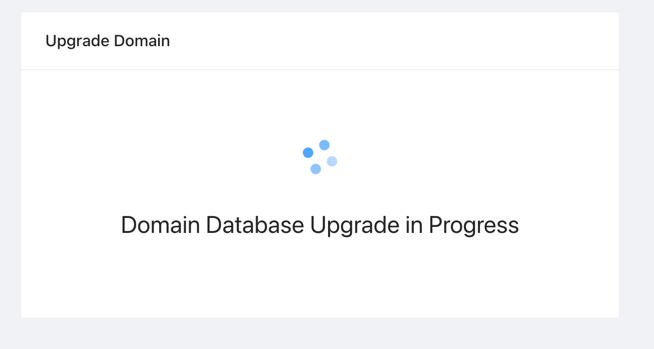
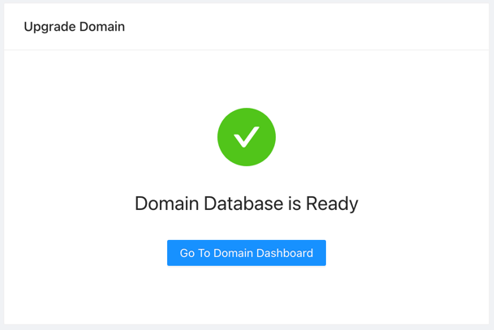

# Upgrading Domains

## Domains Requiring and Schema Upgrade
You will see an indication, informing you that you have domains that are in need of a schema upgrade when you log in to the console after an Convergence version.  If the domain need an upgrade is marked as a favorite, then you will see the Domain Card that looks like the below.  You will notice that instead of a green check mark to the right, there is a yellow / orange database icon. You will also notice that all the link buttons at the bottom of the card has been replaced with an "Update Database" button.

Similarly, if you view the Domains screen, you will also see the same orange database icon and a message stating that a Schema Upgrade is required.

Either clicking on the Upgrade Database button from the dashboard, or the domain id in the Domains screen will take you to the Upgrade process.

## Starting the Upgrade
When entering the domain you will be presented with the following dialog, which asks you to confirm you would like to start the upgrade process.

Once confirmed, the upgrade will be started and you will see the following progress screen.

When the domain upgrade completes you will see the following screen.  Clicking the button on this screen will take you to the domain, and your domain is ready.

